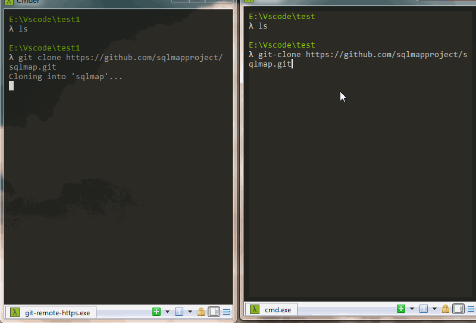

# git-clone

Faster git clone, the download speed is greatly improved.

## git clone VS git-clone

## Installation
python version need 2.7.9+
```
$ pip install git-clone
```
## How to use in terminal
```
git-clone https://github.com/dhgdhg/git-clone.git
git-clone https://github.com/dhgdhg/git-clone.git E:/
git-clone https://github.com/dhgdhg/git-clone.git E:/ master
```

## How to use in py file
```
from git_clone import git_clone
git_clone('https://github.com/dhgdhg/git-clone.git')
git_clone('https://github.com/dhgdhg/git-clone/', 'E:/')
git_clone('https://github.com/dhgdhg/git-clone', 'E:/', 'master')
```

